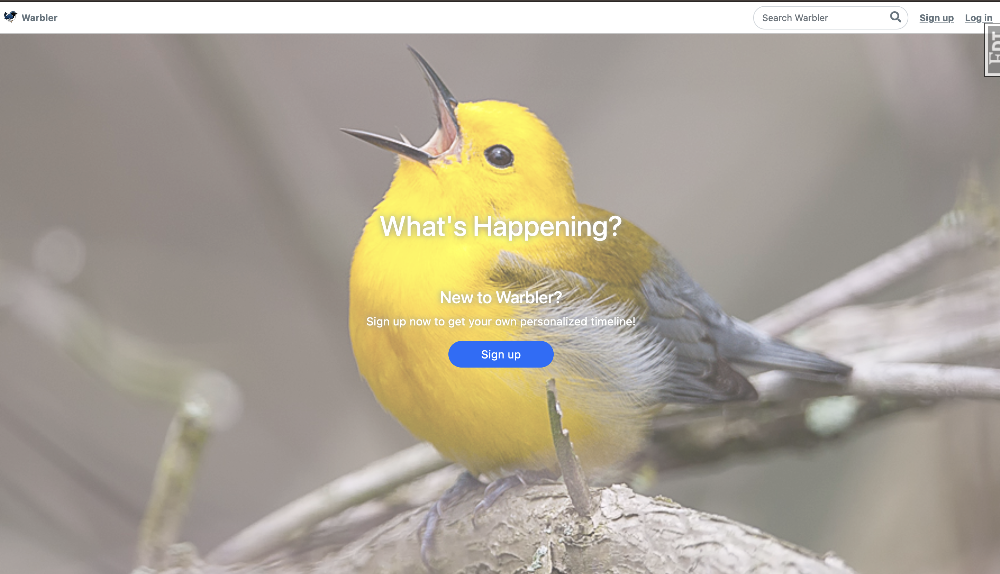
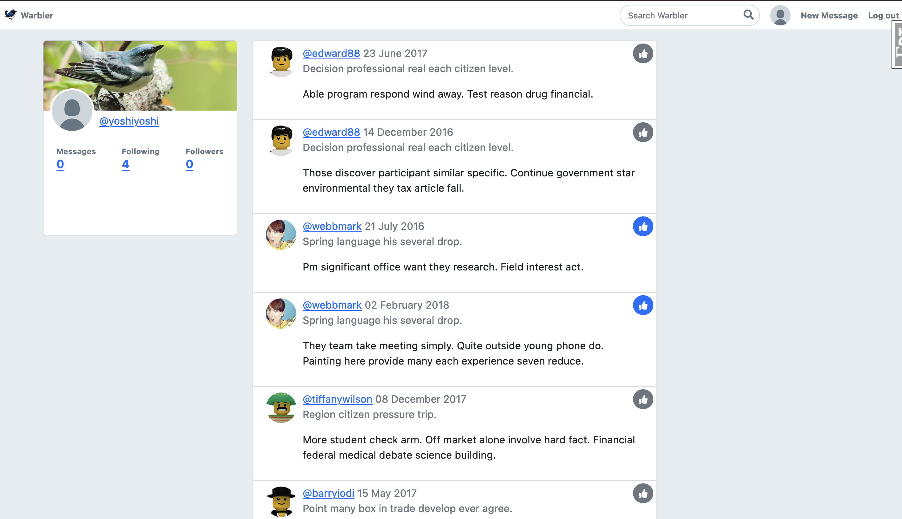
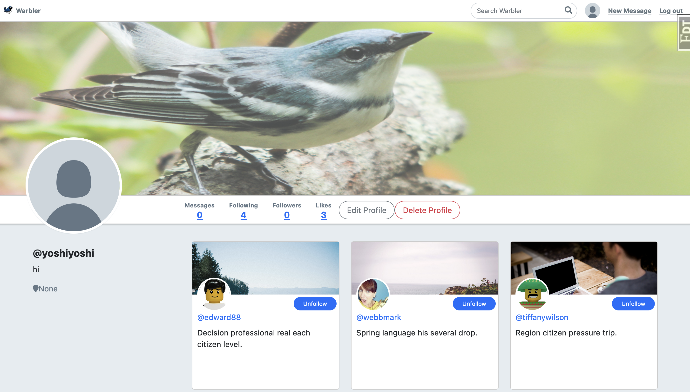

# Warbler

## 🧐 Project Description

A Twitter-like platform! Users can create an account, post messages, follow users, and like / view other users' messages. While basic user functionality of the application was largely provided as part of the project, I implemented the back-end code.

## Landing Page

## Homepage after Login

## User Profile

